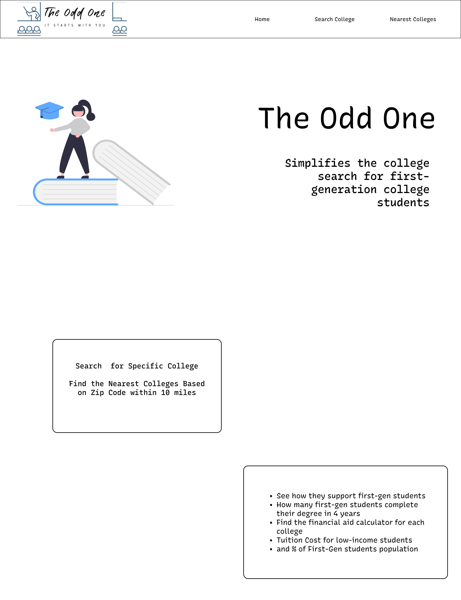

# ✨The Odd One✨

The Odd One is a intuitive website targeted for future first-generation and low-income college students. The goal is to help these students understand how well they will be supported at these higher education institutions. By using public data from the US Department of Education these students are able to make greater decisions on their college search based on location, tuition based on income, and retention of first gen students. Often times this data is not readily available and can be crucial to students college admission process.


# 👩🏽‍🚀 Features
* find the nearest colleges based on zip code
* search for specific college and their relation to first-gen college students
* find resources on finalizing a college search

# 🎨 Wireframe
<div>


</div>

# 🚀 MVP

### API Endpoints:
* college search by zipcode within 10 miles
* search query parameter
### API Fields Used:

* college name
* college zipcode
* college size
* student share of first generation students
* college state
* college url
* retention of completion of either first gen and/or low income
* financial aid calculator url
* id

# 🔨 API

<div>

</div>

**US Department of Education College Scorecard API:**

https://collegescorecard.ed.gov/data/documentation/

We are able to access a storage of data concerning colleges throughout the US. It was interesting to see so much data about students, some categories in this api were more specific than others.


# 🗒️ Component Hierarchy


```
phase-2-project/
  README.md
  node_modules/
  package.json
  public/
    index.html
  src/
    Components/
        HomePage.js
        SearchQuery.js
            DisplaySearchColleges.js (useState/class component)
                SetSearchCollege.js (takes in props/functional component)
        LocationQuery.js
            DisplayLocationColleges.js (useState/class component)
                SetLocationCollege.js (takes in props/functional component)
    App.css
    App.js
    index.js

```

# 🥳 Post-MVP:

### Future Features
- using conditionals in our api calls to return population of first generation college students greater than 25%
- comparison tool of two or 3 colleges similar to Apple’s comparison tool
- dedicated page on final deciding factors which comes down to college offers with better financial aid or greater academic programs (psst…finding that balance is important)
- plan on using material design, maybe tailwinds and/or React component styling

# 📦 Dependencies:

Front-End:

- Axios
- HTML
- CSS

Backend:

- JavaScript
- Netlify

# 👨‍💻 Author

- George Sucuzhanay - [Linkedin](https://www.linkedin.com/in/georgesucuzhanay/)